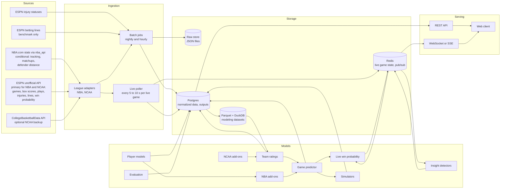

# Basketball Analytics App: Technical Architecture

Last updated: 2026-10-05 (end of design phase)
Companion document: `basketball-analytics-feature-spec.md` (feature numbers below refer to it)

## 1. Context for a new session

This document is a handoff. It proposes an architecture for the app described in the feature spec. Nothing has been built yet.

- **Project phases:** design (complete), then architecture, build, testing, and deploy. Do not skip phases. Do not write application code before the architecture phase is signed off.
- **Status of this design:** the design phase updated this document with its decisions: data-source findings (section 4.0), hosting, cut features, and versions (section 12). The technology stack in section 3, the storage design, and the schema in section 6 are still proposals for the architecture phase to confirm or change.
- **First step for the next session:** start the architecture phase. Review the stack, run the data-source checks in section 4.6, and resolve the open questions in section 14.
- **Target:** V1 launches at the start of the NBA regular season. The NCAA version (V4) should be running and graded daily well before the tournament. The docs track scope by version, not by date.

## 2. Requirements that drive the design

| Requirement | Consequence |
| --- | --- |
| Two leagues, one engine | League-specific code sits behind a common adapter interface. Models are parameterized by league. |
| Core must run without add-ons | Add-on outputs are optional model inputs. A capability matrix says which features each league supports. |
| Near-realtime during games | A poller, a live state store, and a push channel to clients. Target delay from feed to screen: under 15 seconds. |
| Small samples | Bayesian or shrinkage-based estimators with priors and uncertainty, not plain averages. |
| Predictions graded honestly | Predictions are written once, timestamped before tip-off, and never updated. |
| Small audience (a friend group) | One server is enough. Favor simple operations over scale. |
| Everything runs on the owner's existing VPS | No home machine for ingestion. Sources that block the VPS are dropped, along with the features that need them. |
| Free data by default | Paying for data needs a strong case. ESPN is the primary source for both leagues. |
| NCAA is Division I only | Games against non-Division I opponents are excluded at ingestion, from ratings, predictions, and player stats. |
| Open link, no sign-in | Read-only public routes. One admin login for owner actions. |
| Unofficial data sources | Cache everything, keep raw responses, and have a fallback source for each critical feed. |

## 3. System overview



**Proposed stack (to be confirmed in the architecture phase).**

| Layer | Choice | Reason |
| --- | --- | --- |
| Data and models | Python 3.11+, pandas or polars, scikit-learn, statsmodels, LightGBM, PyMC or NumPyro (optional) | `nba_api` and most basketball tooling are Python |
| Service API | FastAPI | Async, typed, has WebSocket support |
| Database | Postgres | Relational data, JSON columns for raw payloads |
| Live state | Redis | Fast key-value state and pub/sub for push |
| Modeling datasets | Parquet files queried with DuckDB | Fast local analytics without loading Postgres |
| Scheduling | APScheduler or cron to start, Prefect if jobs grow | Simple first |
| Frontend | Next.js (React, TypeScript), a charting library such as Recharts or visx | Works on phones and desktops from one codebase |
| Deployment | Docker Compose on the owner's existing VPS | Enough for a friend group. Decided in design. |

## 4. External data sources and APIs

### 4.0 Findings from checks on 2026-10-04 (design phase)

These checks were run with command-line requests from a cloud server, and two NBA.com checks were repeated by the owner from the VPS and a home network. They supersede the assumptions in 4.1 to 4.4 where they conflict.

| Source | Result |
| --- | --- |
| ESPN scoreboard and summary, NBA and NCAA | Works from a cloud server. The summary has the box score, a `plays` array with shot coordinates, injuries, `pickcenter` betting lines, and a `winprobability` series (seen for the NBA; not checked for the NCAA). |
| ESPN history (NBA) | Play-by-play back to at least 2015-16. Team box score statistics are empty for 2015-16 and complete from 2016-17. Betting lines exist for past games (providers such as "consensus" for older seasons, DraftKings for recent ones). Whether these are closing lines is unknown. |
| ESPN scoreboard date ranges | Rejected (`dates=YYYYMMDD-YYYYMMDD` returns HTTP 400). One request per date: about 270 scoreboard calls plus about 1,230 summaries per NBA season. |
| ESPN play order | `sequenceNumber` is not chronological: late corrections get higher numbers. The order of the `plays` array is the game order. |
| ESPN shot coordinates | Missing coordinates use large negative sentinel values and must be treated as missing. |
| stats.nba.com | Timed out with browser-like headers from the cloud server, the owner's VPS, and the owner's home network. This suggests bot detection of command-line clients rather than an IP block. Untested with `nba_api`. |
| cdn.nba.com | HTTP 403 ("Access Denied", Akamai) from the cloud server, the VPS, and the home network for command-line requests. Untested with `nba_api`. |
| NBA injury report PDFs | HTTP 403 from the cloud server. |
| CollegeBasketballData, The Odds API | Reachable, but need an API key (HTTP 401). Not tested further. ESPN's betting lines may make The Odds API unnecessary. |

**Consequences for design:** ESPN is the primary source for both leagues. NBA.com is optional and only feeds features 13, the tracking version of 14, and defender distance in 10. If `nba_api` cannot reach NBA.com from the VPS, those features are dropped or use their ESPN-based versions.

### 4.1 NBA

| Source | What it provides | Access | Limits and risks | Verified |
| --- | --- | --- | --- | --- |
| `nba_api` (Python, PyPI, v1.11.3) | Wrapper for NBA.com. `nba_api.stats` covers historical and season data. `nba_api.live` covers live scoreboard, box score, and play-by-play. | Free, no key, Python 3.10+ | Unofficial. NBA.com does not announce endpoint changes. | Yes: PyPI page |
| stats.nba.com (through `nba_api.stats`) | Game logs, box scores, play-by-play, shot charts, lineups, matchups, clutch, hustle, tracking summaries, defender-distance shooting | Free | Rejects requests without browser-like headers (User-Agent, Referer, Host). Add 1 to 3 seconds between calls. Reported to block some cloud server IP ranges (from general knowledge, not verified this session). | Partly |
| cdn.nba.com live data (through `nba_api.live`) | Live scoreboard, live box score, live play-by-play as JSON | Free | Unofficial. Delay behind real time is not documented. | Partly |
| `nbainjuries` (Python, PyPI, v1.1.1, MIT) | Official NBA injury report as structured data, current and historical, from 2021-22 onward, in 15-minute or hourly snapshots | Free | May need a Java runtime for PDF parsing (not verified). Alternative: `nba-injury-report` on PyPI, licensed AGPL-3.0. | Yes: PyPI page |
| ESPN unofficial API | Fallback for scores, box scores, play-by-play | Free, no key | No documentation, no guarantee, endpoints can change | Yes: several guides |

**stats.nba.com endpoints to use** (names as exposed by `nba_api.stats.endpoints`; confirm against the installed version):

| Purpose | Endpoint | Features |
| --- | --- | --- |
| Schedule and results | `leaguegamefinder`, `scheduleleaguev2` | 1, 2, 6 |
| Box scores | `boxscoretraditionalv3`, `boxscoreadvancedv3` | 1, 7 |
| Play-by-play | `playbyplayv3` | 4, 5, 11, 12 |
| Shot locations | `shotchartdetail` | 10 |
| Lineups | `leaguedashlineups` | 12 |
| Rosters and players | `commonteamroster`, `commonallplayers` | 7 |
| Hustle stats | `leaguehustlestatsplayer` | 14 |
| Tracking summaries (drives, touches, passing, speed and distance) | `leaguedashptstats` with `PtMeasureType` | 14 |
| Shooting by defender distance | `leaguedashplayerptshot`, `leaguedashteamptshot` with `CloseDefDistRange` | 10 |
| Defended shots | `leaguedashptdefend` | 13 |
| Matchups | `boxscorematchupsv3`, `leagueseasonmatchups` | 13 |

**Live endpoints** (`nba_api.live.nba.endpoints`): `scoreboard.ScoreBoard`, `boxscore.BoxScore`, `playbyplay.PlayByPlay`.

**Limits to design around.**

- Raw player coordinates are not public. Only tracking summaries are.
- Tracking and hustle stats update after games, not live.
- Defender distance is available as four buckets per player or team (0-2 ft, 2-4 ft, 4-6 ft, 6+ ft), not per shot.

### 4.2 NCAA Division I men's basketball

| Source | What it provides | Access | Limits and risks | Verified |
| --- | --- | --- | --- | --- |
| ESPN unofficial API | Scoreboard, game summary with box score and play-by-play, teams, rosters, rankings, standings. Shot locations in play-by-play for some games. | Free, no key | Unofficial. The college scoreboard truncates results unless `groups=50&limit=500` is passed. Play-by-play quality varies by game. | Yes: several guides |
| CollegeBasketballData.com API | Games, team and player stats, play-by-play by game, date, team, player, or tournament. Games back to 2003, team and player stats back to 2005. | Free API key | 1,000 calls per month on the free tier, more through a paid tier. Use date-level endpoints to stay under the limit. | Yes: package READMEs |
| sportsdataverse packages (`hoopR` in R, `sportsdataverse` for Python and Node) | Bulk loaders for ESPN college play-by-play and box scores, plus recruiting data from 247Sports | Free | Python package coverage should be confirmed. | Partly |
| Kaggle "March Machine Learning Mania" datasets | Historical results, seeds, and tournament brackets | Free with a Kaggle account | From general knowledge, not verified this session | No |
| Bart Torvik (barttorvik.com) | Public team ratings, returning minutes, transfer data. Useful as a benchmark and for priors. | Free website | Terms of use and export options not verified | No |

**ESPN endpoints** (replace `{league}` with `nba` or `mens-college-basketball`):

```
GET https://site.api.espn.com/apis/site/v2/sports/basketball/{league}/scoreboard?dates=YYYYMMDD
GET https://site.api.espn.com/apis/site/v2/sports/basketball/mens-college-basketball/scoreboard?dates=YYYYMMDD&groups=50&limit=500
GET https://site.web.api.espn.com/apis/site/v2/sports/basketball/{league}/summary?event={eventId}
GET https://site.api.espn.com/apis/v2/sports/basketball/{league}/standings
```

The `summary` response includes the box score and a `plays` array.

### 4.3 Odds (benchmark only)

Only closing moneyline, spread, and total are needed, once per game. No player props and no live odds.

| Source | Free tier | Notes | Verified |
| --- | --- | --- | --- |
| The Odds API | 500 credits per month | A call costs markets x regions credits. Historical calls cost 10 times as much. Three markets in one region once a day is about 90 credits a month per league. | Partly: third-party pricing comparisons |
| OddsPapi | 250 requests per month | Advertises historical odds on the free tier, which would cover backtesting | Vendor claim only |
| Others seen | PropLine, SharpAPI, SportsGameOdds | Free tiers advertised. Not needed unless the two above fall short. | Vendor claims only |

For backtesting on past seasons, historical closing lines are needed. Check the OddsPapi historical endpoint first, then public archives.

### 4.4 Source priority by job

Updated in the design phase: ESPN is primary everywhere, because it is the only source confirmed to work from a server. The architecture phase confirms the fallbacks.

| Job | NBA primary | NBA fallback | NCAA primary | NCAA fallback |
| --- | --- | --- | --- | --- |
| Historical games and box scores | ESPN (2016-17 onward) | `nba_api.stats` if reachable | ESPN | CollegeBasketballData, sportsdataverse |
| Historical play-by-play | ESPN | `nba_api.stats` if reachable | ESPN | sportsdataverse, CollegeBasketballData |
| Live scores and play-by-play | ESPN | `nba_api.live` if reachable | ESPN | None |
| Live win probability benchmark | ESPN `winprobability` | None | ESPN, if present | None |
| Injuries | ESPN injury statuses | `nbainjuries` if reachable | Manual entry (admin page) | None |
| Betting lines (benchmark) | ESPN `pickcenter` | The Odds API | ESPN `pickcenter` | The Odds API |
| Tracking, matchups, defender distance | `nba_api.stats` if reachable | None (feature dropped or ESPN version) | Not applicable | Not applicable |

### 4.5 Ingestion rules

1. Save every raw response to the raw store before parsing, keyed by source, endpoint, parameters, and fetch time.
2. Rate-limit per source: 1 request every 1 to 3 seconds for stats.nba.com, and track monthly quotas for keyed APIs.
3. Retry with backoff. On repeated failure, switch to the fallback source and log it.
4. Map every source's team, player, and game IDs to internal IDs in a crosswalk table.
5. All ingestion runs on the VPS. If NBA.com blocks the VPS, the NBA.com-only features are dropped; there is no home-machine fallback.
6. For the NCAA, drop games where either team is not Division I before writing to the database.
7. Order play-by-play by its position in the source's list, not by the source's sequence number.

### 4.6 Checks for the architecture phase

Done in design (see 4.0): ESPN summaries for one NBA and one NCAA game, with the `plays` array present.

Still to run, from the VPS:

1. Pull one finished NBA game through `nba_api.stats` and the live scoreboard through `nba_api.live`. Decides features 13, 14 (tracking version), and defender distance in 10.
2. Pull ESPN's live summary during a preseason game and measure the delay against a broadcast.
3. Check whether ESPN's `pickcenter` lines for past games are closing lines.
4. Check ESPN's NCAA `winprobability` coverage and how far back ESPN's college box scores and play-by-play go.
5. Check how to identify Division I teams in ESPN data, and the NCAA's official leaderboard minimums.
6. Check whether ESPN play-by-play substitution events are complete enough for lineups and player impact (features 11 and 12).
7. Check whether the NET ranking can be read reliably from the NCAA's site (feature 16).

## 5. League abstraction

Each league implements one adapter. Everything above the adapter is league-agnostic.

```python
class LeagueAdapter(Protocol):
    league: str                                  # "nba" | "ncaam"
    rules: LeagueRules                           # periods, period length, shot clock, bonus rules
    capabilities: set[str]                       # e.g. {"live_pbp", "injury_feed", "tracking", "lineups"}

    def schedule(self, season: str) -> list[Game]: ...
    def box_score(self, game_id: str) -> BoxScore: ...
    def play_by_play(self, game_id: str) -> list[Play]: ...
    def live_games(self) -> list[LiveGame]: ...
    def live_play_by_play(self, game_id: str, since: int) -> list[Play]: ...
    def rosters(self, season: str) -> list[RosterEntry]: ...
```

**Capability matrix.**

| Capability | NBA | NCAA |
| --- | --- | --- |
| Box scores, play-by-play | Yes (ESPN) | Yes (ESPN) |
| Live play-by-play | Yes | Partial |
| Live win probability benchmark (ESPN) | Yes | To be checked |
| Injury feed | Yes (ESPN statuses) | No (manual) |
| Substitutions reliable enough for lineups | To be checked on ESPN data | Partial |
| Tracking summaries, defender distance, matchups | Only if `nba_api` reaches NBA.com from the VPS | No |
| Tournament bracket and seeds | No | Yes |

Features check the matrix at runtime. A feature that lacks its capability is hidden for that league.

## 6. Data model

Postgres tables, grouped. Every table carries `league` and `season`.

**Reference**

- `teams`, `players`, `games`, `rosters`
- `id_crosswalk` (internal ID to each source's ID)

**Game data**

- `team_game_stats`, `player_game_stats`
- `plays` (one row per play-by-play event, normalized event types)
- `possessions` (derived from plays)
- `stints` (derived: a stretch with the same ten players on the floor)
- `injuries` (snapshot time, player, status, reason)
- `closing_lines` (moneyline, spread, total, source, captured time)

**Model outputs**

- `team_ratings` (date, team, overall, offense, defense, standard errors, model version)
- `team_sub_ratings` (date, team, metric, value, percentile)
- `predictions` (game, created time, win probability, margin, total, inputs hash, model version). Append-only.
- `prediction_grades` (prediction, result, log loss, Brier score, margin error, market probability)
- `live_win_prob` (game, event sequence, time, probability)
- `insights` (game, time, type, payload, text)
- `sim_runs`, `sim_team_results` (date, team, outcome, probability)
- `player_projections` (date, player, scope: season or game, stat, mean, low, high)

**NBA add-on outputs**

- `shot_quality` (team or player, expected points per shot, actual, difference)
- `player_impact` (date, player, offense, defense, standard errors)
- `lineup_stats`, `matchup_stats`, `tracking_stats`

**NCAA add-on outputs**

- `field_projection` (date, team, bid probability, projected seed)
- `brackets` (the announced bracket structure), `bracket_sim_results` (team, round, probability)
- `manual_absences` (game, player, entered by)

(`roster_priors` was removed with feature 15. The player-based starting point for team ratings is stored with team ratings.)

## 7. Models

Each model has a version string. Outputs record the version that produced them.

### 7.1 Core

| # | Model | Method | Inputs | Output |
| --- | --- | --- | --- | --- |
| 1 | Team ratings | Ridge regression on per-game offensive and defensive efficiency with team, opponent, and home-court terms, refit every time a game finishes, with recency weighting. Garbage time removed or down-weighted. High-luck components (opponent 3-point and free-throw percentage) regressed toward the mean. Preseason prior as pseudo-observations that decay with games played. V1 prior: box-score player values from last season, applied to current rosters by expected minutes, with last season's rating regressed about one third toward average as a fallback. V3 prior: player impact ratings. Standard errors from the regression or a bootstrap. | `team_game_stats`, `player_game_stats`, rosters | Overall, offense, defense with uncertainty |
| 1 | Sub-ratings | The same opponent-adjusted regression, run per metric: effective field goal %, 3-point % and attempt rate, turnover %, opponent turnover % and steal %, offensive rebound %, defensive rebound %, free-throw rate, opponent 2-point %, and pace | `team_game_stats` | Value and percentile per metric |
| 2 | Game predictor | Expected possessions from both teams' pace. Expected points from offense against defense. Adjust for home court, rest, travel, and availability. Win probability from a normal distribution on margin, with the spread of results fitted per league. Optional gradient-boosted layer on top once the baseline is graded. | Ratings, schedule, injuries, add-ons | Win probability, margin, total, ranges |
| 3 | Matchup explainer | For each sub-rating pair (offense strength against the opposing defense), convert the gap to expected points and rank | Sub-ratings | Ranked list of mismatches with text |
| 4 | Live win probability | Logistic regression or gradient boosting on score difference, time remaining, possession, pregame win probability, and foul and bonus state. Trained on historical play-by-play. Calibrated. One model per league. | `plays`, pregame prediction | Probability per event |
| 5 | Insight detectors | Rule-based detectors: scoring runs, shooting far from expectation (binomial test against season rate), lineup scoring margin within a stint, foul trouble, large win probability swings. Text from templates. Ranking and rate limits so the feed stays readable. | Live state | Insight cards |
| 6 | Season simulator | Monte Carlo, 10,000 runs, re-run every time a game finishes. Each run samples team ratings from their uncertainty, then samples each remaining game. League-specific rules: NBA play-in and tiebreakers; NCAA conference regular-season titles and tournament bids (no conference tournaments). | Ratings, schedule | Odds per team and outcome, with history |
| 7 | Player projections | Per-minute rates with empirical Bayes shrinkage toward a prior by position, age or class year, and role. Separate minutes model. Similar players by nearest neighbors on standardized features. | `player_game_stats` | Season projection with ranges |
| 8 | Evaluation | Log loss, Brier score, calibration curve, mean absolute error on margin and total. Market probabilities from closing lines with the bookmaker margin removed. Ablation runs with each add-on switched off. | `predictions`, results, `closing_lines` | Report card |

### 7.2 NBA add-ons

| # | Model | Method |
| --- | --- | --- |
| 9 | Single-game player projections | Minutes projection (role, injuries, blowout risk from the predicted margin) times per-minute rates, adjusted for opponent sub-ratings and pace. Ranges from the historical spread of outcomes at that minutes level. |
| 10 | Shot quality | Expected points per shot by court zone from `shotchartdetail`, adjusted by defender-distance bucket mix at player and team level. Shot-making over expected is actual minus expected. Feeds the game predictor as a regression-to-expectation term. |
| 11 | Player impact | Regularized adjusted plus-minus: ridge regression over stints, multiple seasons with recency weights, with a box-score-based prior. |
| 12 | Lineup analysis | Aggregate stints by lineup and by two- and three-player combinations. Blend observed margin with the sum of player impact ratings, weighted by possessions. |
| 13 | Defensive matchups | Aggregate matchup possessions by scorer and defender. Likely matchup from recent starters and position. |
| 14 | Tracking profiles | Percentiles of tracking and hustle summaries by position group. |

**Availability adjustment in the game predictor (NBA).** Only players with ESPN status "Out" count. For each one, subtract his value weighted by expected minutes, then add back the value of the players who absorb those minutes. Until V3 the value is the box-score player value; from V3 it is the impact rating.

### 7.3 NCAA add-ons

Features 15 (roster turnover priors) and 18 (bracket builder) were cut in design. The NCAA preseason starting point uses the same player-based method as model 1.

| # | Model | Method |
| --- | --- | --- |
| 16 | Tournament field projection | Classifier for at-large selection and an ordinal model for seed, trained on past selections, using record, wins by opponent tier, and rating. Automatic bids come from simulated conference tournaments. |
| 17 | Bracket simulator | The season simulator's engine at neutral sites over the bracket tree. Likely upsets are games where the model's probability for the lower seed exceeds the historical rate for that seed pairing by a set margin. |

**Availability adjustment (NCAA).** No impact ratings. Scale the team's rating by the absent player's share of minutes and production, from a hand-entered absence.

### 7.4 Training and evaluation protocol

1. Train on past seasons only. Evaluate walk-forward: predict each game using only data available before it.
2. Tune the small-sample behavior by scoring only the first 5 to 15 games of NBA seasons. This approximates college conditions.
3. A change ships only if it improves walk-forward log loss.
4. Compare against two baselines: home team always wins, and the closing line.

## 8. Live pipeline

1. A scheduler starts a poller for each game shortly before tip-off.
2. The poller requests live play-by-play every 5 to 10 seconds and keeps the last event sequence it has seen.
3. New events are normalized by the league adapter and appended to `plays`.
4. Game state in Redis is updated: score, clock, possession, fouls, players on the floor, running box score.
5. The live win probability model scores the new state. ESPN's own win probability for the same game is fetched and stored next to ours as a benchmark.
6. Insight detectors run on the new state and may emit cards.
7. The new probability and any cards are published to a Redis channel for that game and written to Postgres.
8. The API server forwards channel messages to subscribed clients over WebSocket or server-sent events.
9. At the final whistle, the poller stops, the game is marked final, and the nightly batch re-pulls the official play-by-play to correct any live errors.

**Load.** An NBA night has at most 15 games. A busy college Saturday has more than 100. For NCAA, poll the scoreboard for all games, and poll play-by-play only for games that a user has open or that are flagged as featured.

## 9. Batch schedule

| Job | When | Does |
| --- | --- | --- |
| Schedule sync | Daily, morning | Updates games and tip-off times |
| Injury sync (NBA) | Every 15 minutes on game days | Pulls the injury report, re-runs affected predictions as new rows |
| Pregame predictions | On schedule sync, on injury change, and locked 30 minutes before tip-off | Writes `predictions` |
| Betting lines | Once per game, close to tip-off, from ESPN | Writes `closing_lines` (benchmark only) |
| Game-final update | Within minutes of each game going final | Box score and play-by-play, team ratings, grading, season simulator |
| Post-game corrections | Nightly | Re-pulls official box scores and play-by-play, derives possessions and stints, refits player models and add-ons |
| Field projection and bracket simulator | Daily (NCAA) | Writes `field_projection`, `bracket_sim_results` |
| Tracking refresh (NBA) | Nightly | Tracking, hustle, matchup, defender-distance summaries |

## 10. Application API

REST, read-only for fans. `{league}` is `nba` or `ncaam`. Team and player endpoints take a `season` parameter for the season picker. The table below predates the design phase's screen changes (Teams and Players tables, team page tabs, Compare moved to a later version); the architecture phase should revise it against feature spec section 6.

| Method and path | Returns | Features |
| --- | --- | --- |
| `GET /{league}/games?date=` | Games with locked predictions | 2 |
| `GET /{league}/games/{id}` | Game detail: prediction, explainer, absences, final result | 2, 3 |
| `GET /{league}/games/{id}/win-probability` | Full win probability series | 4 |
| `GET /{league}/games/{id}/insights` | Insight cards so far | 5 |
| `WS /{league}/games/{id}/live` | Stream of state, probability, and cards | 4, 5 |
| `GET /{league}/ratings?date=` | Ratings table with sub-ratings | 1 |
| `GET /{league}/teams/{id}` | Team page data | 1, 6, 12 |
| `GET /{league}/players/{id}` | Player page data | 7, 9, 11, 13, 14 |
| `GET /{league}/season/odds` | Simulator results | 6 |
| `GET /{league}/report-card` | Accuracy, calibration, comparison with the market | 8 |
| `GET /nba/games/{id}/projections` | Single-game player projections | 9 |
| `GET /nba/shot-quality?scope=team\|player` | Shot quality and shot-making over expected | 10 |
| `GET /nba/teams/{id}/lineups` | Lineup analysis | 12 |
| `GET /ncaam/field` | Tournament field projection | 16 |
| `GET /ncaam/bracket/odds` | Round-by-round odds and likely upsets | 17 |
| `POST /ncaam/games/{id}/absences` | Hand-entered absence (owner only) | 2 |

## 11. Suggested repository layout

```
/ingest
  /adapters      nba.py, ncaam.py, espn.py, cbbd.py, odds.py, injuries.py
  /jobs          schedule_sync.py, postgame.py, injuries.py, closing_lines.py
  live_poller.py
/core
  schema/        SQL migrations
  derive/        possessions.py, stints.py
/models
  ratings.py  sub_ratings.py  game_predictor.py  live_wp.py
  insights/     detectors
  simulate.py   players.py    evaluate.py
  /nba          projections.py, shot_quality.py, rapm.py, lineups.py, matchups.py, tracking.py
  /ncaam        field.py, bracket_sim.py
/api            FastAPI app, routers per section 10
/web            Next.js client
/notebooks      exploration and backtests
/tests
docker-compose.yml
```

## 12. Versions

Scope by version, from the feature spec (section 7). No dates. V1 targets the start of the NBA regular season. Each version goes through build, testing, and deploy.

| Version | Scope | Done when |
| --- | --- | --- |
| V1 | ESPN data pipeline on the VPS and backfill from 2016-17. Team ratings with roster-based starting point. Game predictor with ESPN injury statuses. Matchup explainer. Evaluation and past-season backtests. Screens: Tonight, game page (Preview, Box score, final result), Teams, team page, Players, player page (Overview, Game log), Report card. Season picker. | Friends can open the app on opening night, and walk-forward results exist for past seasons |
| V1.1 | Single-game player projections, projected vs. actual, Admin page | Projections graded for real games |
| V2 | Live poller, our live win probability and ESPN's, analyst feed, running box score, push to clients | Live game page works on a game night |
| V3 | Player impact ratings (and roster-aware ratings and absences), shot quality, lineups, play-style profiles, defensive matchups if NBA.com is reachable, season simulator | Each add-on has an ablation result |
| V4 | NCAA Division I adapter and backfill, ratings, predictor, core screens, ESPN live win probability line, season simulator, running and graded daily | Months of graded college predictions before March |
| V5 | Field projection, bracket simulator with likely upsets, our NCAA live win probability | Ready when the bracket is announced |
| Later | Compare screen, share links, sign-in if needed | |

## 13. Risks

| Risk | Effect | Mitigation |
| --- | --- | --- |
| NBA.com blocks access from the VPS | Features 13, tracking 14, and defender distance in 10 are unavailable | ESPN is primary for everything else. Drop those features or use their ESPN-based versions. No home-machine fallback, by decision. |
| ESPN changes its unofficial endpoints | NCAA live and fallback data fail | Adapter isolation, CollegeBasketballData for batch data, contract tests that run daily |
| ESPN's past betting lines are not closing lines | The market comparison in backtests is less precise | Check in the architecture phase. Label the line type on the report card; fall back to grading against the market from launch onward only. |
| College play-by-play is uneven | Live feed and lineup features are unreliable | Capability flags per game, degrade to score-only win probability |
| Live feed delay | Insights arrive after the broadcast shows them | Measure the delay in the smoke tests, set expectations in the interface |
| Overfitting to the NBA | The model does worse on college data | Early-season NBA tests, separate per-league fitting, two months of background grading on NCAA games |
| Unofficial data and terms of use | Sources may restrict use | The app is an open link for a friend group, with no sign-in. Avoid publicizing it; add sign-in if it spreads. Review each source's terms before any public release. |

## 14. Open questions

Answered in the design phase:

- Website or app: responsive website, dark mode by default.
- Hosting: the owner's existing VPS. No home machine for ingestion.
- Accounts: none. Open link; one admin login for the owner. Sign-in may be added later.
- Data budget: free by default; paying needs a strong case.
- Insight text: template-based.
- NCAA absences: entered by the owner only, in the admin page.

Still open, for the architecture phase:

1. Confirm the stack in section 3, or choose another.
2. Does `nba_api` work from the VPS? (Section 4.6, check 1.)
3. The remaining checks in section 4.6.
4. App name (owner, any time before deploy).

## 15. Sources checked on 2026-10-04

- nba_api on PyPI: https://pypi.org/project/nba-api
- nbainjuries on PyPI: https://pypi.org/project/nbainjuries/
- nba-injury-report on PyPI: https://pypi.org/project/nba-injury-report/
- NBA.com stats endpoints, headers, tracking and defender-distance data: https://www.mintlify.com/gabriel1200/site_Data/data-sources
- ESPN unofficial API guides: https://zuplo.com/blog/2024/10/01/espn-hidden-api-guide and https://sportsapis.dev/espn-api
- ESPN college scoreboard parameters: https://github.com/pseudo-r/public-espn-api
- CollegeBasketballData API limits: https://github.com/CFBD/cbbd-r
- CollegeBasketballData play-by-play endpoints (via hoopR): https://rdrr.io/cran/hoopR/src/R/cbbd_plays.R
- sportsdataverse (Node) coverage: https://npmjs.com/package/sportsdataverse
- The Odds API free tier and credit costs (third-party comparison): https://oddspapi.io/blog/?p=2498
- 2026-27 NBA season dates: https://www.api-football.com/news/post/2026-2027-nba-season-guide-to-using-data-with-api-sports
- NBA league leader minimums (checked 2026-10-05): https://www.nba.com/stats/help/statminimums
